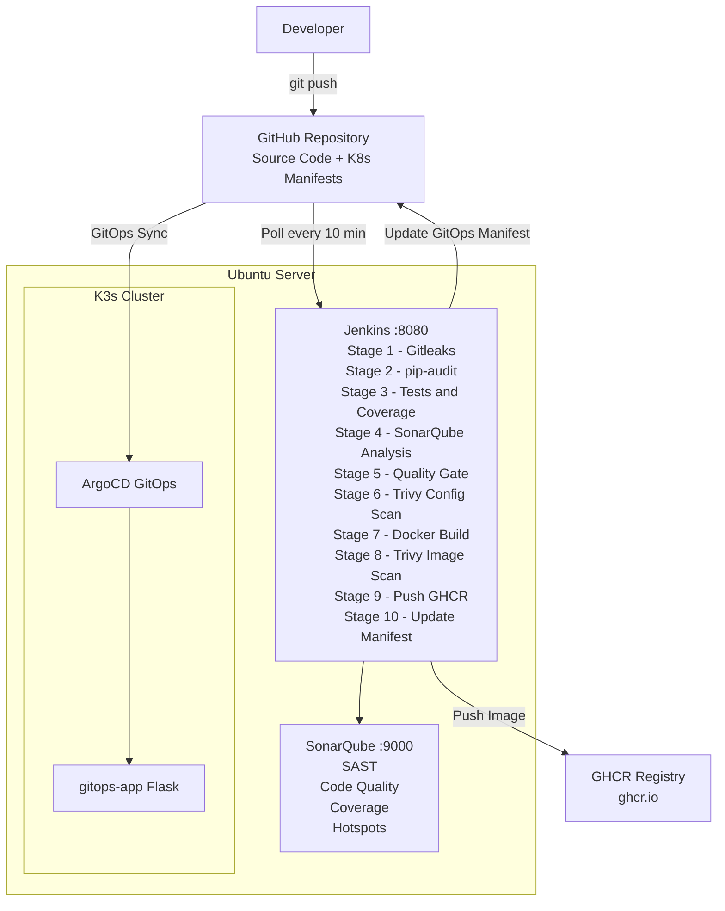

# gitops-demo

```mermaid
flowchart TB

    Dev[Developer]
    GH[GitHub Repository<br/>Source Code + K8s Manifests]
    REG[GHCR Registry<br/>ghcr.io]

    Dev -->|git push| GH

    GH -->|Poll every 10 min| Jenkins
    Jenkins -->|Update GitOps Manifest| GH
    Jenkins -->|Push Image| REG

    subgraph Ubuntu_Server["Ubuntu Server"]

        Jenkins["Jenkins :8080
        Stage 1 - Gitleaks
        Stage 2 - pip-audit
        Stage 3 - Tests and Coverage
        Stage 4 - SonarQube Analysis
        Stage 5 - Quality Gate
        Stage 6 - Trivy Config Scan
        Stage 7 - Docker Build
        Stage 8 - Trivy Image Scan
        Stage 9 - Push GHCR
        Stage 10 - Update Manifest"]

        Sonar["SonarQube :9000
        SAST
        Code Quality
        Coverage
        Hotspots"]

        subgraph K3s_Cluster["K3s Cluster"]
            ArgoCD["ArgoCD GitOps"]
            App["gitops-app Flask"]

            ArgoCD --> App
        end

        Jenkins --> Sonar
    end

    GH -->|GitOps Sync| ArgoCD
```
