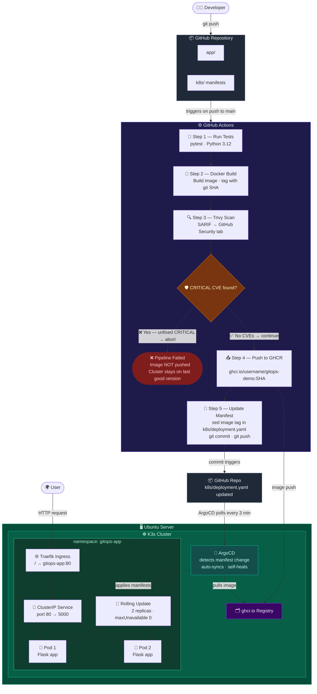

# gitops-demo
## devops

```mermaid
flowchart TD
    DEV([👨‍💻 Developer])
    DEV -->|git push| GH

    subgraph GH ["📦 GitHub Repository"]
        APP["app/"]
        K8S["k8s/ manifests"]
    end

    GH -->|triggers on push to main| CI

    subgraph CI ["⚙️ GitHub Actions"]
        S1["🧪 Step 1 — Run Tests
        pytest · Python 3.12"]

        S1 --> S2

        S2["🐳 Step 2 — Docker Build
        Build image · tag with git SHA"]

        S2 --> S3

        S3["🔍 Step 3 — Trivy Scan
        SARIF → GitHub Security tab"]

        S3 --> S4

        S4{"🛡️ CRITICAL CVE found?"}

        S4 -->|❌ Yes — unfixed CRITICAL → abort| FAIL
        S4 -->|✅ No CVEs → continue| S5

        S5["📤 Step 4 — Push to GHCR
        ghcr.io/username/gitops-demo:SHA"]

        S5 --> S6

        S6["📝 Step 5 — Update Manifest
        sed image tag in k8s/deployment.yaml
        git commit · git push"]
    end

    FAIL(["❌ Pipeline Failed
    Image NOT pushed
    Cluster stays on last good version"])

    S6 -->|commit triggers| GH2

    GH2["📦 GitHub Repo
    k8s/deployment.yaml updated"]

    GH2 -->|ArgoCD polls every 3 min| ARGO

    S5 -->|image push| GHCR["🗂️ ghcr.io Registry"]

    subgraph K3S ["🖥️ Ubuntu Server"]
        subgraph CLUSTER ["☸️ K3s Cluster"]
            ARGO["🔄 ArgoCD
            detects manifest change
            auto-syncs · self-heals"]

            ARGO -->|pulls image| GHCR
            ARGO -->|applies manifests| DEP

            subgraph NS ["namespace: gitops-app"]
                DEP["🔁 Rolling Update
                2 replicas · maxUnavailable 0"]
                DEP --> POD1["🐍 Pod 1
                Flask app"]
                DEP --> POD2["🐍 Pod 2
                Flask app"]
                SVC["🔀 ClusterIP Service
                port 80 → 5000"]
                ING["🌐 Traefik Ingress
                / → gitops-app:80"]
                ING --> SVC
                SVC --> POD1
                SVC --> POD2
            end
        end
    end

    USER([🌍 User]) -->|HTTP request| ING

    style FAIL fill:#7f1d1d,color:#fecaca,stroke:#991b1b
    style CI fill:#1e1b4b,color:#e0e7ff,stroke:#4338ca
    style K3S fill:#064e3b,color:#d1fae5,stroke:#059669
    style CLUSTER fill:#065f46,color:#d1fae5,stroke:#10b981
    style NS fill:#0f3d2e,color:#a7f3d0,stroke:#34d399
    style GH fill:#1f2937,color:#f3f4f6,stroke:#6b7280
    style GH2 fill:#1f2937,color:#f3f4f6,stroke:#6b7280
    style GHCR fill:#3b0764,color:#ede9fe,stroke:#7c3aed
    style S4 fill:#78350f,color:#fef3c7,stroke:#d97706
    style ARGO fill:#134e4a,color:#ccfbf1,stroke:#14b8a6
```
