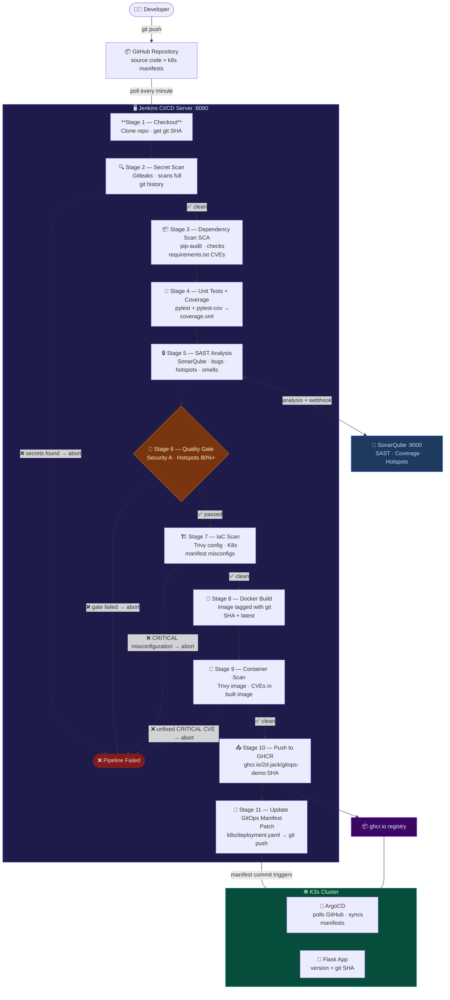

# gitops-demo

```mermaid
flowchart TD
    DEV([👨‍💻 Developer])
    DEV -->|git push| GH

    GH["📦 GitHub Repository
    source code + k8s manifests"]

    GH -->|poll every minute| J1

    subgraph JENKINS ["🖥️ Jenkins CI/CD Server :8080"]
        J1["**Stage 1 — Checkout**
        Clone repo · get git SHA"]

        J1 --> J2

        J2["🔍 Stage 2 — Secret Scan
        Gitleaks · scans full git history"]

        J2 -->|❌ secrets found → abort| FAIL
        J2 -->|✅ clean| J3

        J3["📦 Stage 3 — Dependency Scan SCA
        pip-audit · checks requirements.txt CVEs"]

        J3 --> J4

        J4["🧪 Stage 4 — Unit Tests + Coverage
        pytest + pytest-cov → coverage.xml"]

        J4 --> J5

        J5["🔒 Stage 5 — SAST Analysis
        SonarQube · bugs · hotspots · smells"]

        J5 --> J6

        J6{"🚦 Stage 6 — Quality Gate
        Security A · Hotspots 80%+"}

        J6 -->|❌ gate failed → abort| FAIL
        J6 -->|✅ passed| J7

        J7["🏗️ Stage 7 — IaC Scan
        Trivy config · K8s manifest misconfigs"]

        J7 -->|❌ CRITICAL misconfiguration → abort| FAIL
        J7 -->|✅ clean| J8

        J8["🐳 Stage 8 — Docker Build
        image tagged with git SHA + latest"]

        J8 --> J9

        J9["🔎 Stage 9 — Container Scan
        Trivy image · CVEs in built image"]

        J9 -->|❌ unfixed CRITICAL CVE → abort| FAIL
        J9 -->|✅ clean| J10

        J10["📤 Stage 10 — Push to GHCR
        ghcr.io/2d-jack/gitops-demo:SHA"]

        J10 --> J11

        J11["📝 Stage 11 — Update GitOps Manifest
        Patch k8s/deployment.yaml → git push"]
    end

    FAIL(["❌ Pipeline Failed"])

    J5 <-->|analysis + webhook| SQ

    SQ["🔎 SonarQube :9000
    SAST · Coverage · Hotspots"]

    J11 -->|manifest commit triggers| ARGO

    subgraph K3S ["☸️ K3s Cluster"]
        ARGO["🔄 ArgoCD
        polls GitHub · syncs manifests"]
        ARGO --> APP
        APP["🐍 Flask App
        version = git SHA"]
    end

    J10 --> GHCR["📦 ghcr.io registry"]
    GHCR --> ARGO

    style FAIL fill:#7f1d1d,color:#fecaca,stroke:#991b1b
    style JENKINS fill:#1e1b4b,color:#e0e7ff,stroke:#4338ca
    style K3S fill:#064e3b,color:#d1fae5,stroke:#059669
    style SQ fill:#1e3a5f,color:#bfdbfe,stroke:#2563eb
    style J6 fill:#78350f,color:#fef3c7,stroke:#d97706
    style GHCR fill:#3b0764,color:#ede9fe,stroke:#7c3aed
```

