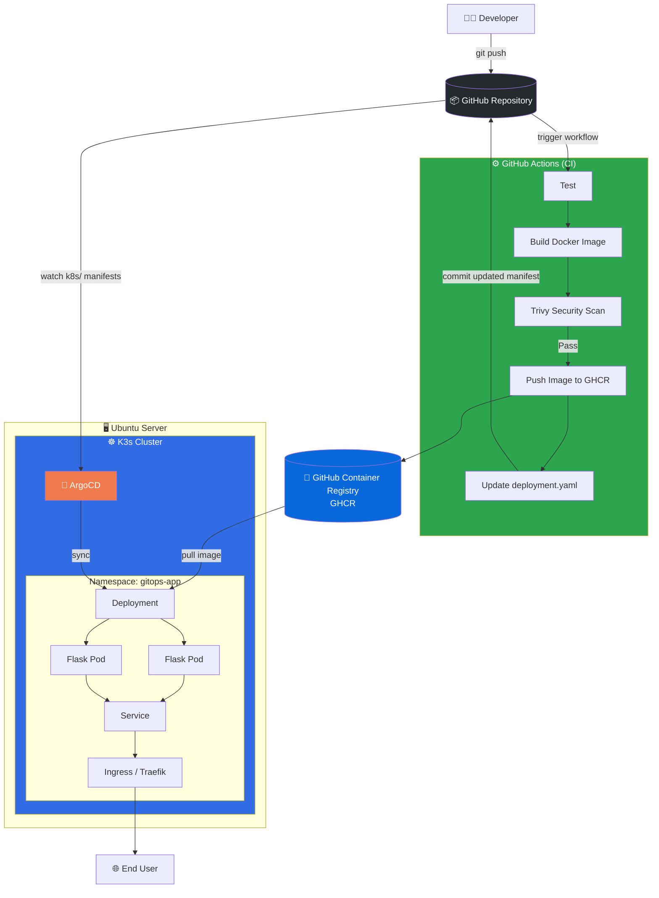

# gitops-demo

```mermaid
flowchart TB

    Dev[👨‍💻 Developer]

    Repo[(📦 GitHub Repository)]

    subgraph CI["⚙️ GitHub Actions (CI)"]
        T[Test]
        B[Build Docker Image]
        S[Trivy Security Scan]
        P[Push Image to GHCR]
        M[Update deployment.yaml]
    end

    Registry[(🐳 GitHub Container Registry<br/>GHCR)]

    subgraph Server["🖥️ Ubuntu Server"]
        
        subgraph K3S["☸️ K3s Cluster"]
            
            Argo[🔄 ArgoCD]

            subgraph NS["Namespace: gitops-app"]
                Deploy[Deployment]
                Pod1[Flask Pod]
                Pod2[Flask Pod]
                SVC[Service]
                ING[Ingress / Traefik]
            end
        end
    end

    User[🌐 End User]

    Dev -->|git push| Repo

    Repo -->|trigger workflow| T
    T --> B
    B --> S

    S -->|Pass| P
    P --> Registry

    P --> M
    M -->|commit updated manifest| Repo

    Repo -->|watch k8s/ manifests| Argo

    Registry -->|pull image| Deploy

    Argo -->|sync| Deploy

    Deploy --> Pod1
    Deploy --> Pod2

    Pod1 --> SVC
    Pod2 --> SVC

    SVC --> ING
    ING --> User

    style Repo fill:#24292e,color:#fff
    style Registry fill:#0969da,color:#fff
    style Argo fill:#ef7b4d,color:#fff
    style K3S fill:#326ce5,color:#fff
    style CI fill:#2da44e,color:#fff
```
